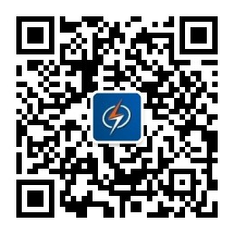

# ebook

这里列举了软件测试从业者应该学习的书籍，书籍不分优先、也不分重要程度，由苦叶子持续更新中

注：**这里不提供任何下载资源**

- 软件测试的艺术

- Web应用程序性能测试指南

- 探索式软件测试

- Google软件测试之道

- 微软的软件测试之道

- 软件测评师教程

- 单元测试的艺术

- 全程软件测试

- 人月神话

- ISO-IEC-IEEE29119-1

- ISO-IEC-IEEE29119-2

- ISO-IEC-IEEE29119-3

- ISO-IEC-IEEE29119-4

- ISO-IEC-IEEE29119-5

- web安全测试

- 软件产品质量要求和测试细则 ——GB/T 25000.51—2016标准实施指南

- 安全测试指南(第4版)

- Python基础教程

- Python核心编程

- 软件调试（第二版）

- 测试之美

- jenkins权威指南

- 图解HTTP

- 图解TCP/IP

- HTTP权威指南

- Web性能权威指南

- 响应式Web设计 HTML5和CSS3实战

- 逆向工程核心原理

- 逆向工程权威指南

- Python灰帽子

- 利用Python进行数据分析

- Python3标准库

- Python自然语言处理

- Python数据科学手册

- Python统计分析

- 数据结构（Python语言描述）

- Python黑帽子

- scikit-learn机器学习

- Flask Web开发

- 深入理解Flask

- DevOps实践指南

- 六西格玛手册

- IATF 16949质量管理体系五大工具

- 质量经理手册

- 六西格玛管理

- 丰田模式

- 朱兰质量手册

- 朱兰质量管理与分析

- 戴明论质量管理

- 戴明管理思想精要：质量管理之父的领导力法则

- ISO 9001：2015 新思维+新模式

苦叶子的公众号：开源优测

